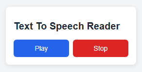

# 🔊 Text-to-Speech Reader

A simple Chrome Extension to **convert any selected text on a webpage into speech** using the Web Speech API. Perfect for multitasking, accessibility, or just listening on the go!

---

## 🚀 Features

- ✅ Select text on any webpage and instantly convert it to speech
- ✅ Uses Web Speech API for natural-sounding voices
- ✅ Context menu integration for quick access
- ✅ Control playback: play, stop
- ✅ Clean and modern User Interface
- ✅ Backend with Node.js + Express (no database required)

---

## 📸 Preview



---

## 🧰 Tech Stack

- **Chrome Extension API (Manifest V3)**
- **HTML/CSS**
- **JavaScript (Vanilla)**
- **Web Speech API**
- **Node.js + Express.js (for backend)**
- **File-based JSON storage**

---

## 📦 Installation (Development)

### 🔧 Prerequisites

- [Node.js](https://nodejs.org/)
- Google Chrome (latest)
- Chrome Developer Mode enabled

---

### 🖥️ Backend Setup

1. Clone the repository:
   ```bash
   git clone https://github.com/sheix-khizar/Text-To-Speech-Reader_Chrome-Extension.git
   cd tts-reader-extension/server
   ```

2. Install dependencies:
   ```bash
   npm install
   ```

3. Run the server:
   ```bash
   node server.js
   ```

> Server will run at `http://localhost:3000`

---

### 🧩 Load Chrome Extension

1. Open **Chrome** and navigate to: `chrome://extensions`
2. Enable **Developer Mode** (top right)
3. Click **"Load unpacked"** and select the `extension` folder from the repo

---

## 🗂️ Folder Structure

```
tts-reader-extension/
├── public/            # Chrome extension files (popup, scripts, manifest)
├── server/            # Node.js + Express backend
│   └── server.js      # Express server file
├── README.md
└── preview.png        # Screenshot or preview image
```

---

## 🛠️ API Endpoints

| Method | Endpoint        | Description               |
|--------|------------------|---------------------------|
| POST   | `/speak`         | Convert sent text to speech |
| GET    | `/status`        | Check server status        |

---


## 💡 Inspiration

Built for better accessibility and convenience with a user-friendly design and local backend.

---

## 🙌 Support

Submit issues or feature requests on GitHub. Contributions are welcome!
